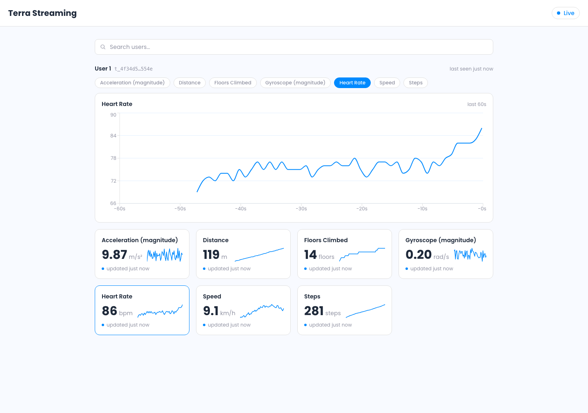
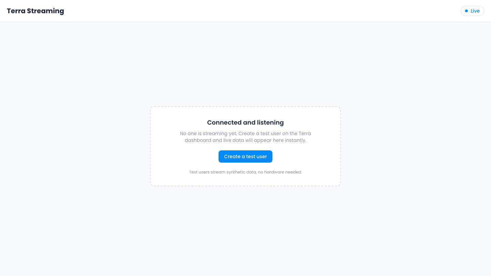

# Terra Pulse

An example web app built on Terra's [Streaming API](https://docs.tryterra.co/streaming-api). It connects to Terra's WebSocket broker as a *consumer* and renders live readings (heart rate, steps, acceleration, and more) on a real-time dashboard.

It's the *consumer* half of a streaming integration (the Terra → your app path). A tiny token server stands in for your backend; the browser holds the WebSocket connection itself.



## What It Demonstrates

- **Consumer authentication**: minting a single-use developer token server-side, so your API key never reaches the browser
- **The connection lifecycle**: `HELLO` → `IDENTIFY` → `READY` → `DISPATCH`, with jittered heartbeats and an explicit close-code policy
- **Resilient reconnects**: fresh-token reconnects with exponential backoff, telling retryable drops apart from protocol bugs
- **Live rendering**: per-user, per-type rolling buffers feeding a scrolling chart and sparkline stat cards, coalesced so high-frequency streams never overwhelm React
- **Honest states**: connecting, waiting, reconnecting, and disconnected, each with a clear next step

## Tech Stack

| Layer     | Technology                                                    |
| --------- | ------------------------------------------------------------- |
| Frontend  | React 19 + TypeScript on Vite 7                               |
| Styling   | Tailwind CSS v4, Terra design tokens, Poppins                 |
| Charts    | Recharts (hero time-series), inline-SVG sparklines            |
| Backend   | A ~50-line Express token server (a stand-in for your backend) |
| Streaming | A framework-free `StreamingConsumer` WebSocket client, no SDK |

## Prerequisites

- [Node.js](https://nodejs.org/) 18 or later
- A Terra **Dev ID** and **API key** from the [Terra dashboard](https://dashboard.tryterra.co) → API keys

## Quick Start

```bash
npm install
cp .env.example .env      # then paste your Dev ID and API key
npm run dev               # token server on :4000 + Vite on :5173
```

Open <http://localhost:5173>. The header pill goes **Connecting… → Live** once the consumer authenticates.

To see data, create a **test user** on the [dashboard streaming page](https://dashboard.tryterra.co/dashboard/streaming?create=1); it streams synthetic heart rate, steps, and more through the live API. A user section appears the moment data flows.



## Scripts

```bash
npm run dev          # token server + Vite together
npm run dev:server   # Express token server only (tsx watch)
npm run dev:web      # Vite dev server only
npm run build        # type-check and build for production
npm run typecheck    # type-check only
```

## Project Structure

```
.
├── server/
│   └── index.ts            # POST /api/token: mints a consumer token (your backend's stand-in)
├── src/
│   ├── lib/
│   │   ├── protocol.ts     # opcodes, close codes, frame types, parse guard
│   │   ├── consumer.ts     # StreamingConsumer: lifecycle, heartbeat, reconnect (start here)
│   │   ├── dataTypes.ts    # data-type registry: labels, units, formatting, fallback
│   │   ├── store.ts        # per-user/per-type rolling buffers, coalesced re-renders
│   │   └── stream.ts       # singleton wiring + the mintToken seam
│   ├── hooks/
│   │   └── useStream.ts     # useSyncExternalStore binding
│   └── components/          # StatusPill, StatCard, Sparkline, LiveChart, UserSection, EmptyState
└── docs/                    # screenshots used by this README
```

Start with `src/lib/consumer.ts`; it implements the consumer protocol end to end and is heavily commented.

## Bring Your Own Backend

The browser must never hold your `x-api-key`, so token minting happens server-side. It's one HTTPS call, in any language:

```bash
curl -X POST https://ws.tryterra.co/auth/developer \
  -H "dev-id: YOUR_DEV_ID" \
  -H "x-api-key: YOUR_API_KEY"
# → { "token": "..." }
```

The bundled Express server is the smallest version of that. To reuse the consumer in your own product, copy `src/lib/consumer.ts` unchanged, point the `mintToken` closure in `src/lib/stream.ts` at your endpoint, and delete `server/`.

## Environment Variables

| Variable        | Required | Description                                                |
| --------------- | -------- | ---------------------------------------------------------- |
| `TERRA_DEV_ID`  | Yes      | Terra developer ID, used to mint tokens                    |
| `TERRA_API_KEY` | Yes      | Terra API key. Server-side only; never sent to the browser |
| `PORT`          | No       | Port for the local token server (default `4000`)           |

Both credentials come from the [Terra dashboard](https://dashboard.tryterra.co) → API keys.

## License

Apache-2.0
