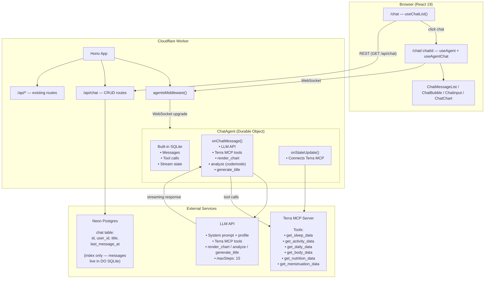
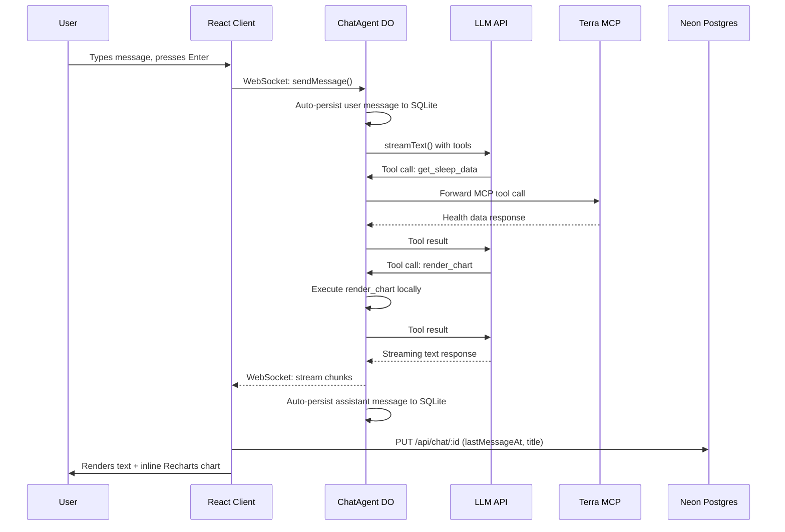

# AI Health Chat

An agentic AI health assistant powered by an LLM, integrated with Terra health data via MCP.

## Overview

Users interact with the assistant through a chat interface. It can query health data from connected wearable devices (via the Terra MCP) and render inline charts. Each user can create multiple conversations, browse their history, and continue old chats.

## Architecture



### Data flow: sending a message



## Data Flow

### Chat list

1. `useChatList()` calls `GET /api/chat`
2. Hono route queries Neon: `SELECT * FROM chat WHERE user_id = ? ORDER BY last_message_at DESC`
3. Client renders `ChatCard` per conversation
4. Clicking a card navigates to `/chat/:chatId`
5. `useAgent` opens WebSocket to the DO instance — messages load from SQLite

## Dual Storage Design

**Neon Postgres** stores a lightweight **chat index** — which chats exist, who owns them, what they're called. This is needed because Durable Objects can't be queried across instances.

**DO SQLite** (built into each Durable Object, managed by the SDK) stores the **actual chat messages**. This is automatic — the `AIChatAgent` class handles persistence, streaming state, and reconnection with zero custom SQL.

|            | Postgres                              | DO SQLite                          |
| ---------- | ------------------------------------- | ---------------------------------- |
| What       | Chat metadata (id, title, timestamps) | Messages, tool calls, stream state |
| Why        | Listing & ownership queries           | Per-chat persistence & streaming   |
| Managed by | Drizzle ORM                           | Agents SDK (automatic)             |

## Key Files

| File                                                | Purpose                                             |
| --------------------------------------------------- | --------------------------------------------------- |
| `src/server/agents/chat-agent.ts`                   | ChatAgent Durable Object — LLM, tools, MCP          |
| `src/server/lib/chat/chart-tool.ts`                 | render_chart tool definition                        |
| `src/server/lib/chat/analysis-tool.ts`              | analyze tool (codemode wrapper)                     |
| `src/server/routes/chat.ts`                         | Chat CRUD API routes                                |
| `src/server/index.ts`                               | Worker entry — exports ChatAgent, mounts middleware |
| `src/client/routes/_authenticated/chat/$chatId.tsx` | Chat page — WebSocket + UI                          |
| `src/client/routes/_authenticated/chat/index.tsx`   | Chat list page                                      |
| `src/client/components/pages/chat/`                 | UI components (bubbles, input, chart, cards)        |
| `src/client/hooks/useChatQueries.ts`                | TanStack Query hooks for chat CRUD                  |
| `db/schema.ts`                                      | Chat table definition                               |
| `wrangler.jsonc`                                    | DO binding + SQLite migration                       |

## Tools

### Terra MCP (remote)

Connected via `MCPClientManager` when the user has an active Terra connection. Provides tools for querying sleep, activity, daily, body, nutrition, and menstruation data.

### render_chart (local)

Produces structured chart data that the client renders as an inline Recharts chart. Uses the same theme as TrendChart (CSS variables: `--color-emphasis`, `--color-border`, etc.).

### analyze (local, codemode)

Sandboxed JavaScript execution for statistical analysis via `@cloudflare/codemode`. The LLM writes code to compute statistics (mean, median, min, max, standard deviation), aggregate data across date ranges, calculate derived metrics (BMI, heart rate zones), and find correlations. The sandbox has access to Terra MCP tools and `render_chart`, enabling fetch → compute → visualize in a single execution.

> Uses the `LOADER` Worker Loaders binding, which requires the Cloudflare Workers Paid plan. Setup only adds it when you enable the AI assistant; declining keeps the app on the free plan (the analyze tool is registered only when `env.LOADER` is present).

### generate_title (local)

Auto-generates a short conversation title after the first exchange. The client detects the tool result and updates the Neon `chat.title` via REST.

## Configuration

### Environment Variables / Secrets

| Variable            | Required       | Where                                  |
| ------------------- | -------------- | -------------------------------------- |
| `ANTHROPIC_API_KEY` | Yes (for chat) | `wrangler secret put` / CI secret bulk |
| `TERRA_DEV_ID`      | Yes (for MCP)  | Already configured                     |
| `TERRA_API_KEY`     | Yes (for MCP)  | Already configured                     |
| `DATABASE_URL`      | Yes            | Already configured                     |

### Infrastructure

The Durable Object binding and its SQLite migration are declared in `wrangler.jsonc`
and applied by `wrangler deploy` (run by `npm run deploy`).

```jsonc
// wrangler.jsonc — used for both local dev and production deployment
"worker_loaders": [{ "binding": "LOADER" }],
"durable_objects": {
  "bindings": [{ "name": "ChatAgent", "class_name": "ChatAgent" }]
},
"migrations": [{ "tag": "v1", "new_sqlite_classes": ["ChatAgent"] }]
```

## Dependencies

| Package                | Purpose                                |
| ---------------------- | -------------------------------------- |
| `agents`               | Cloudflare Agents SDK core             |
| `@cloudflare/ai-chat`  | AIChatAgent class + React hooks        |
| `ai`                   | Vercel AI SDK (required by Agents SDK) |
| `@ai-sdk/anthropic`    | Anthropic provider adapter             |
| `hono-agents`          | Hono middleware for routing to DOs     |
| `@cloudflare/codemode` | Sandboxed JS execution for analysis    |
