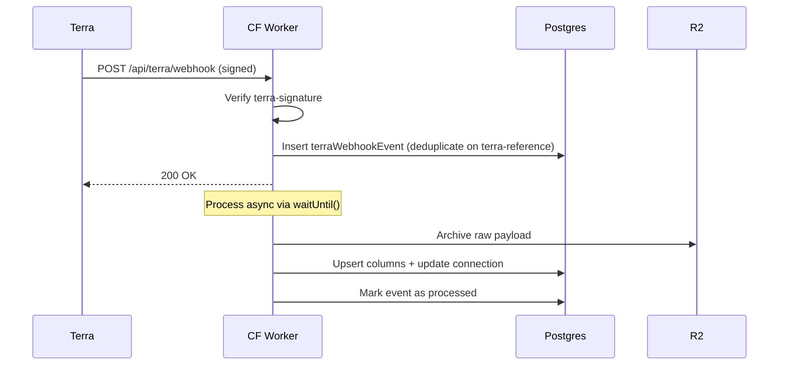

# Terra Webhooks

Terra delivers health data and connection lifecycle events via webhooks to `POST /api/terra/webhook`.

## Webhook lifecycle



1. **Verify** - Signature checked via `verifyTerraWebhookSignature()` before parsing JSON. Rejects with 401 if missing or invalid.
2. **Deduplicate** - `terra-reference` header inserted into `terraWebhookEvent` with a unique constraint. If it already exists, return 200 immediately (already processed).
3. **Acknowledge** - Return 200 within Terra's 8-second timeout.
4. **Process async** - `c.executionCtx.waitUntil()` handles archival and data processing outside the response lifecycle.

> Key files: `src/server/routes/terra/webhook.ts`, `src/server/lib/terra/webhook-handler.ts`

## Data storage architecture

Raw webhook payloads are archived in R2. The DB stores only extracted metrics in typed columns — no JSONB blobs. Each data row has a `payload_key` column linking back to its R2 raw payload for detailed access.

```
R2  → raw JSON payload (archive, debugging, detail views)
DB  → extracted columns (scores, biomarkers, timestamps)
       └── payload_key → R2 object key
```

## Idempotency keys

Per [Terra's data handling guidance](https://docs.tryterra.co/health-and-fitness-api/managing-user-health-data/receiving-data-updates):

| Data type    | Table                | Primary key                   | Terra guidance                                 |
| ------------ | -------------------- | ----------------------------- | ---------------------------------------------- |
| Activity     | `terra_activity`     | `summary_id`                  | Unique by `metadata.summary_id`                |
| Sleep        | `terra_sleep`        | `summary_id`                  | Unique by `metadata.summary_id`                |
| Daily        | `terra_daily`        | `(terra_connection_id, date)` | "Only consider the date part, ignore the time" |
| Body         | `terra_body`         | `(terra_connection_id, date)` | Same as daily                                  |
| Nutrition    | `terra_nutrition`    | `(terra_connection_id, date)` | Same as daily                                  |
| Menstruation | `terra_menstruation` | `(terra_connection_id, date)` | Same as daily                                  |

No surrogate UUID `id` columns — every table uses its natural key from Terra as the primary key.

## Timestamp handling

Terra timestamps include timezone offsets when available (e.g. `2026-04-02T00:00:00.000000+01:00`), controlled by `metadata.timestamp_localization` (0 = UTC, 1 = local time).

**Daily-type tables** store only the calendar `date` (Postgres `date` type). The date is extracted from `metadata.start_time` by slicing the first 10 characters of the ISO string BEFORE any timezone conversion:

```typescript
const date = item.metadata.start_time.slice(0, 10); // "2026-04-02"
```

This avoids timezone edge cases where UTC conversion could shift the calendar day.

**Activity/Sleep tables** store `start_time` and `end_time` as Postgres `timestamp` (without timezone). The original timezone offset is lost on storage. The frontend displays times in the user's browser timezone.

## Upsert strategies

All data writes use `onConflictDoUpdate` keyed on natural identifiers. Two distinct strategies:

**Standard overwrite** (biomarkers, base activity/sleep fields): Terra guarantees "the received data will always be a superset of any previous data received." Latest webhook wins.

**COALESCE upsert** (enrichment scores on `terra_daily` and `terra_sleep`): `data_enrichment` scores do NOT follow the superset guarantee — subsequent webhooks can have null enrichment while earlier ones had values. Score columns use `COALESCE(excluded.col, table.col)` so nulls never overwrite non-null values.

```sql
-- Biomarkers: standard overwrite
steps = excluded.steps,
resting_hr_bpm = excluded.resting_hr_bpm,

-- Scores: nulls never overwrite
total_stress_score = COALESCE(excluded.total_stress_score, terra_daily.total_stress_score),
strain_index = COALESCE(excluded.strain_index, terra_daily.strain_index),
```

## Event types

**Data events** - `activity`, `sleep`, `body`, `daily`, `nutrition`, `menstruation`

Each carries a `data[]` array of records. The handler looks up the `terraConnection` by `terraUserId`, extracts metrics into columns, and upserts into the appropriate table. `lastWebhookAt` is updated on the connection after processing.

**Auth events** - covered in [Terra Auth & Reconciliation](terra-auth-and-reconciliation.md).

**Informational events** - `healthcheck`, `processing`, `large_request_processing`, `large_request_sending`, `rate_limit_hit`, `google_no_datasource`. Logged but not acted on.

## R2 archival

When `TERRA_WEBHOOKS_BUCKET` is configured, raw webhook payloads are archived to R2 at:

```
webhooks/{YYYY}/{MM}/{DD}/{eventId}.json
```

This happens async alongside event processing. Each data row stores its `payload_key` for traceability back to the raw payload.

> Key files: `db/schema.ts`, `src/server/lib/terra/webhook-handler.ts`
